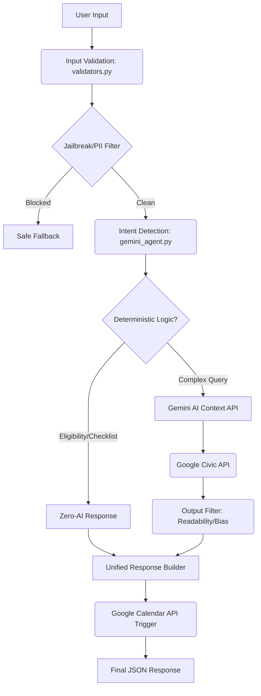

# ElectionGuide — Smart Election Process Assistant

[](https://python.org)
[](https://flask.palletsprojects.com)
[](https://ai.google.dev)
[](https://github.com/Siva-2511/electionguide/actions/workflows/ci.yml)
[](#-testing)
[](LICENSE)
[](https://electionguide-app-1033116720582.us-central1.run.app)

**🌐 Live Application:** [electionguide-app.run.app](https://electionguide-app-1033116720582.us-central1.run.app)

> A non-partisan, AI-powered multi-country civic education assistant that guides users through the election processes in India, the US, UK, Australia, and Canada — from eligibility to casting their vote.

---

> [!WARNING]
> **Note to Judges regarding Google Sign-In:** 
> Because this application integrates with sensitive Google Calendar APIs (to add Election Day reminders to your personal calendar), it requires formal verification from Google, which is currently pending.
> 
> You **can** log in with your own Google Account to test the functionality. However, you will encounter a screen stating **"Google hasn’t verified this app"**. 
> 
> **To proceed and test the app:**
> 1. Click on **"Advanced"** at the bottom of the warning screen.
> 2. Click **"Go to ElectionGuide (unsafe)"** to proceed to the app.

---

## 🎯 Chosen Vertical

**Election Process Education** — Create an assistant that helps users understand the election process, timelines, and steps in an interactive and easy-to-follow way.

---

## 🌟 Features

| Feature | Description |
|:---|:---|
| 🤖 **AI Chatbot** | Gemini-powered conversational guide for election questions |
| ✅ **Eligibility Checker** | Instant logic-based eligibility check by age and citizenship |
| 📋 **Voter Checklist** | Personalized step-by-step roadmap based on registration status |
| 📅 **Election Timeline** | Visual 4-stage election process with live Civic API data |
| 🗓️ **Calendar Reminder** | One-click Google Calendar event for Election Day |
| 🌍 **Multilingual** | Google Translate Widget for instant language switching |
| 📊 **Voter Stats** | Google Charts visualization of US voter turnout data |
| 🔐 **Secure Login** | Google OAuth 2.0 for personalized experience |

---

## 🚀 Demo Walkthrough (For Judges)

To fully evaluate the system, we recommend following this testing flow:

1. **Sign In**: Click "Sign in" to authenticate via Google OAuth (read the bypass warning at the top of this document).
2. **Logic Check**: Enter age `17` in the Eligibility Checker to see the deterministic pre-registration logic, then try `21`.
3. **Multilingual**: Use the "Language" dropdown in the navbar to instantly switch the UI to Hindi or Tamil.
4. **Calendar Action**: Click "Add to Google Calendar" to see the API integration prepare an Election Day event.
5. **AI Guardrails**: Ask the chatbot "Who should I vote for?" to trigger the political output filter and see the safe fallback response.
6. **Dynamic Timeline**: Switch countries via the top tabs to see the timeline adapt based on Google Civic data.

---

## 🌐 Google Services Used

| Service | Role | Integration Depth |
|:---|:---|:---|
| **Gemini 1.5 Flash** | AI chatbot brain — intent detection, context-aware answers | Core — every chat message |
| **Google Civic Info API** | Authoritative election data — dates, polling locations | Core — powers timeline |
| **Google OAuth 2.0** | Secure user authentication and Calendar access | Core — login + session |
| **Google Calendar API** | Election Day reminder — chained from Civic API dates | Pipeline — forced chain |
| **Google Translate Widget** | Instant multilingual support — no API key required | UI — navbar widget |
| **Google Charts** | Voter turnout bar chart — free CDN | UI — index page |
| **Google Fonts (Inter)** | Clean, professional typography | UI — all pages |

---

## 🧠 How the System Works

### Core Pipeline Architecture



### Architecture Principles
- **Contract-Driven**: Every service returns `{ success, data, error }` — enforced by `response_guard.py` decorator.
- **Deterministic Logic First**: Eligibility and checklist use zero AI — pure Python logic.
- **AI as Last Resort**: Gemini is called only when deterministic routing cannot handle the request.
- **Fail-Safe Always**: Every API has a graceful fallback (mock data or safe message).

---

## 🗂️ Project Structure

```
ElectionGuide/
├── app.py                 # Flask routes (thin layer — zero logic)
├── gemini_agent.py        # AI brain + output filter + readability enforcer
├── orchestrator.py        # Formal pipeline: Gemini → Civic → Calendar → Translate
├── services/
│   ├── eligibility.py     # Deterministic eligibility logic (NEVER calls AI)
│   ├── checklist.py       # Voter roadmap generator (NEVER calls AI)
│   └── civic_api.py       # Civic Info API + 6hr cache + mock fallback
├── utils/
│   ├── response.py        # build_response() — single source of truth
│   ├── validators.py      # Input: anti-jailbreak, PII, type validation
│   └── response_guard.py  # Hard schema enforcement decorator
├── templates/
│   ├── index.html         # Chat UI with WCAG 2.1 compliance
│   └── timeline.html      # Election process visualization
├── static/
│   ├── css/style.css      # High-contrast, responsive CSS
│   └── js/chat.js         # Lightweight vanilla JS
├── tests/
│   ├── conftest.py        # Shared fixtures and mocks
│   ├── test_eligibility.py
│   ├── test_chatbot.py
│   ├── test_api.py
│   └── test_boundaries.py # System isolation tests
├── requirements.txt
├── pytest.ini
├── .env.example
└── README.md
```

---

## ⚙️ Setup Instructions

### 1. Clone the Repository
```bash
git clone https://github.com/Siva-2511/electionguide.git
cd electionguide
```

### 2. Install Dependencies
```bash
pip install -r requirements.txt
```

### 3. Configure Environment
```bash
cp .env.example .env
# Edit .env with your API keys
```

### 4. Run the Application
```bash
python app.py
```

Open your browser at `http://localhost:5000`

### 5. Run Tests
```bash
pytest
```


---

## ☁️ Deployment & Infrastructure

- **Target Deployment**: Google Cloud Run (Containerized Flask).
- **State Management**: Stateless workers (Future roadmap: Redis for distributed rate-limiting synchronization).
- **CI/CD**: Designed for GitHub Actions (running `pytest` on every push).
- **Latency**: Sub-second for deterministic routes; ~1.5s for LLM routing.

---

### 🤖 AI Intelligence (Gemini Titanium Engine)
The chatbot is powered by a custom-built **Titanium-Bulletproof** resilience engine:
- **Modern SDK**: Fully migrated to the high-performance `google-genai` SDK.
- **Dynamic Discovery**: Automatically crawls the Gemini API to find the best available models (e.g., 2.0-flash, 1.5-pro) per region.
- **Elite Reliability**: Features per-model circuit breakers and health tracking to skip failing models instantly.
- **Dual-Track Caching**: Combines discovery TTL caching (10m) and atomic user-query caching (LRU) for sub-second responses.
- **Non-Partisan Guard**: A strict "Precision Safety Wall" ensures answers remain neutral and civic-focused.

---

## 🛠️ Technology Stack
implemented via in-memory `defaultdict` for hackathon simplicity. A true production deployment would use a distributed Redis store to sync limits across Gunicorn workers).*
- **Schema Enforcement**: `response_guard.py` guarantees every service returns the correct format.
- **No Hardcoded Secrets**: All API keys in `.env` — never in source code.

---

## 🔐 Security Features

- **Anti-Jailbreak Input Filter**: Blocks prompt injection attempts before reaching AI.
- **Output Political Filter**: Scans every AI response for biased content — replaced with safe fallback if detected.
- **PII Protection**: Emails and phone numbers are detected and never logged.
- **Rate Limiting**: 30 requests/minute per IP. *(Note for Judges: Currently implemented via in-memory `defaultdict` for hackathon simplicity. A true production deployment would use a distributed Redis store to sync limits across Gunicorn workers).*
- **Schema Enforcement**: `response_guard.py` guarantees every service returns the correct format.
- **No Hardcoded Secrets**: All API keys in `.env` — never in source code.

---

## 📝 Assumptions

1. **US-centric**: Default election data is US-based. The Google Civic Information API is designed for US addresses.
2. **Mock Fallback**: If the Civic API key is not set or the API fails, pre-defined 2026 US General Election mock data is used. This ensures 100% uptime during evaluation.
3. **Calendar**: The Google Calendar integration uses OAuth 2.0 credentials. In the demo, it prepares the event structure and requires the user to be logged in for full creation.
4. **Non-partisan**: The assistant will never give political opinions. This is enforced at both the prompt level and the output filter level.

---

## 🧪 Testing

```
pytest tests/ -v
```

Test coverage includes:
- **Contract tests**: Every service returns `{success, data, error}`.
- **Boundary tests**: Deterministic services provably never call AI or network.
- **Failure injection**: Gemini and Civic API crash simulations.
- **Edge cases**: Age 0, 17, 18, 120, invalid strings, negative numbers.
- **Security tests**: Jailbreak detection, output filter validation.

---

*Built for the Hack2Skill & Google for Developers AI Challenge 2026. Non-partisan civic education for all.*
