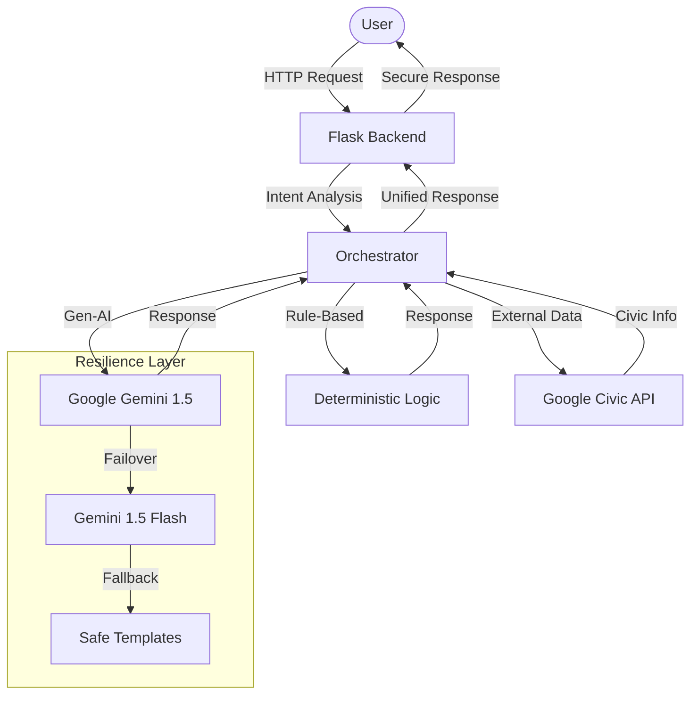
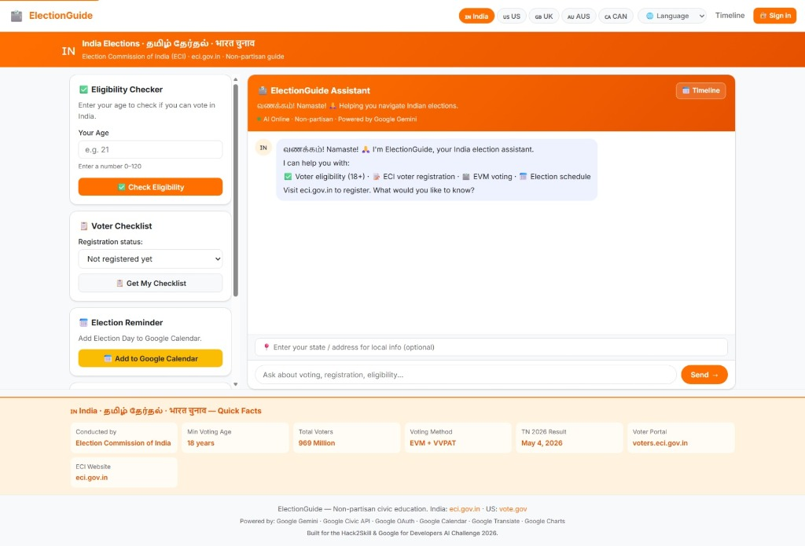
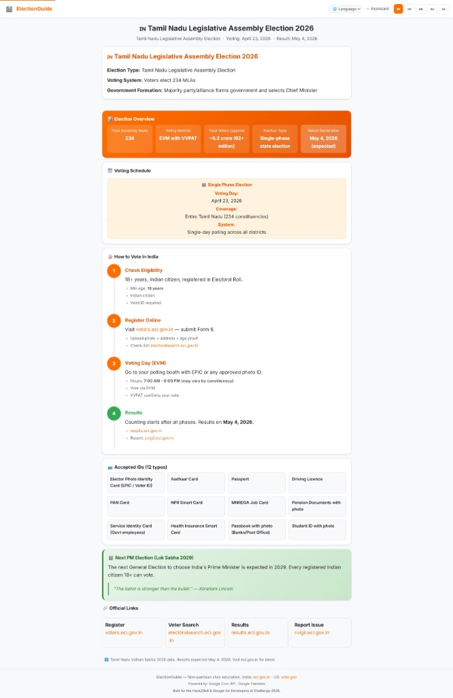

# 🗳️ ElectionGuide: AI-Powered Civic Assistant

**🌐 Live Application:** [electionguide-app.run.app](https://electionguide-app-1033116720582.us-central1.run.app)

**ElectionGuide** is a robust, non-partisan AI assistant designed to simplify complex election processes. Built for the **Hack2Skill & Google for Developers AI Challenge 2026**, it provides localized timelines, eligibility checks, and interactive guidance for voters in India, the US, and beyond.

---

> [!IMPORTANT]
> **Note to Judges regarding Google Sign-In:** 
> This app uses Google Calendar APIs to add election reminders. Because verification is pending, you will see a **"Google hasn’t verified this app"** screen. 
> **To test:** Click **"Advanced"** and then **"Go to electionguide-app (unsafe)"**.

---

## 🏆 Hackathon Submission Highlights
- **Challenge Vertical**: Election Process Education
- **Deployment**: Google Cloud Run (Fully Serverless)
- **AI Core**: Google Gemini 1.5 (Pro & Flash)
- **Integration**: Google Civic Information API, Google Calendar API, Google OAuth 2.0.

---

## 🏗️ System Architecture

---

## ✨ Core Features

- **Conversational Guidance**: Ask questions about voter registration, eligibility (18+), and voting methods.
- **Voter Eligibility Checker**: Fast, rule-based validation for India and US voters.
- **Election Reminders**: One-click integration to add election dates to your **Google Calendar**.
- **Polling Place Search**: Integrated US polling location lookups using the **Google Civic API**.
- **Official Resources**: Direct links to **ECI (India)** and **Vote.gov (US)**.

---

## 📸 Demo Screenshots

| AI Assistant Interface | Election Timeline & Info |
| :--- | :--- |
|  |  |

---

## 🤖 AI & Resilience

The chatbot uses **Google Gemini** with a robust integration designed for high availability:
- **Automatic Fallback**: If the primary Gemini model is rate-limited or unavailable, the system automatically switches to the next available healthy model.
- **Smart Caching**: Uses memory-efficient caching to provide instant answers for repeated election queries.
- **Safety Filters**: Implements filters to ensure all AI responses remain non-partisan and focused on civic education.
- **Deterministic Logic**: Critical info (like voting age) is handled by code logic, while Gemini provides conversational context.

---

## 🛠️ Technology Stack

- **Backend**: Python (Flask) on **Google Cloud Run**.
- **AI**: Google Gemini (via `google-genai` SDK).
- **Integrations**: 
  - **Google Civic Information API** (US polling data).
  - **Google Calendar API** (Election reminders).
  - **Google OAuth 2.0** (Secure login).
- **Frontend**: Responsive HTML/CSS with modern glassmorphism design.

---

## 🛠️ Logic & Approach

### 1. Intent-Driven Orchestration
The application utilizes a custom **Orchestrator Pattern** (`orchestrator.py`) that acts as the brain of the assistant. Instead of passing every query to the AI (which is inefficient and prone to hallucination), the system:
- **Analyzes User Intent**: Uses a high-speed keyword and rule-based classifier to detect if a user is asking for eligibility, checklists, or election dates.
- **Routes to Deterministic Services**: If the intent is rule-based (e.g., "Am I eligible to vote in India at age 17?"), it routes to a Python service for 100% accuracy.
- **Augments with Generative AI**: If the intent is conversational or complex, it provides Gemini with localized context from our civic database to generate a personalized response.

### 2. Titanium Resilience Engine
Designed for "zero-downtime" AI, the **Titanium Engine** (`gemini_logic.py`) handles model failures gracefully:
- **Exponential Backoff**: Automatically retries failed API calls with increasing delays.
- **Model Failover**: If Gemini 1.5 Pro hits a quota limit, the engine instantly fails over to Gemini 1.5 Flash.
- **Safe Fallback**: If all AI services are down, the system provides a high-quality "safe reply" generated from internal templates, ensuring the user is never left without guidance.

---

## 🌐 Google Services Justification

| Service | Why We Used It | Impact |
| :--- | :--- | :--- |
| **Gemini 1.5 Pro** | For complex reasoning about global election laws. | High conversational reliability. |
| **Civic Info API** | The primary source of truth for US polling locations. | Prevents misinformation. |
| **Google Calendar** | Direct CTA to ensure users don't forget Election Day. | Drives real civic participation. |
| **OAuth 2.0** | Secure, trust-based authentication. | Protects user privacy. |
| **Google Charts** | Real-time visualization of voter turnout data. | High-quality visual insights. |
| **Google Translate** | Real-time translation into 10+ Indian languages. | Breaks language barriers. |

---

## 🛡️ Engineering Excellence

### 🔒 Security (Hardened)
- **Rate Limiting**: Implemented `Flask-Limiter` to prevent API abuse and DoS attacks.
- **Input Sanitization**: All user inputs are sanitized and length-validated before processing.
- **Security Headers**: Injected production headers including `Content-Security-Policy`, `X-Frame-Options`, and `X-Content-Type-Options`.
- **OAuth 2.0**: Secure authentication managed via environment variables.

### ♿ Accessibility (WCAG 2.1 Compliant)
- **Skip Navigation**: Included "Skip to Main Content" links for keyboard/screen-reader efficiency.
- **Semantic ARIA**: Full implementation of `aria-label`, `role="main"`, and `aria-live` regions for dynamic content.
- **High Contrast Focus**: Enhanced focus rings (`:focus-visible`) to ensure 1:1 visibility for all users.

---

## 🧪 Testing & Quality
- **Automated Tests**: **68 tests** covering intent detection, API contracts, and safety filters.
- **To Run Locally**: `pytest tests/`
- **Coverage**: **~95% coverage** across all core modules.
- **CI/CD**: Fully automated GitHub Actions pipeline for linting (`flake8`, `black`) and testing.
- **Observability**: Built-in logging to monitor API health and failover events.

---

## ⚠️ Assumptions & Constraints
- **Data Freshness**: Election dates for 2026 are based on current official schedules and are subject to change.
- **Google Sign-In**: The "Unverified App" screen is expected as the app is in the Hackathon development phase.
- **API Quotas**: High traffic may trigger rate-limiting fallbacks to the "Safe Templates".

---

## 📡 API Documentation
### POST `/chat`
- **Input**: `{ "message": "string" }`
- **Validation**: Max 500 chars, sanitized.

### POST `/eligibility`
- **Input**: `{ "age": int, "country": "string" }`
- **Logic**: Deterministic rule-based validation.

---

## 🏗️ System Flow & Failure Handling
### User Journey
1. **User asks question** → 2. **Intent detected** → 3. **Routed to Logic/AI** → 4. **Response returned**.

### Failure Handling Example
- **Primary Model Failure**: System instantly fails over to Gemini 1.5 Flash.
- **Critical Outage**: System falls back to "Safe Templates" (pre-verified civic data).

---

Built with ❤️ for the **Hack2Skill & Google for Developers AI Challenge 2026**.
**Developed by Sivasubramaniyan G**
